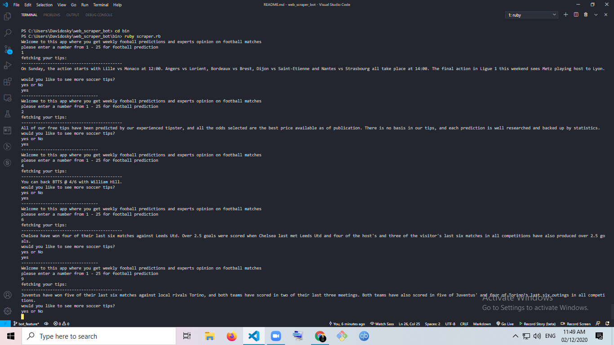

# web_scraper_bot
<<<<<<< HEAD
this is a Ruby Capstone project for building a bot that scraps selected data from a web page
 This program's purpose is to scan a webpage and take relevant data from it. This project provides useful soccer tips.

In this project, user will find 24 weekely soccer tips from experts.
=======
this is a milestone project for building a bot that scraps selected data from a web page

# ruby_web_scraper

> This program's purpose is to scan a webpage and take relevant data from it. This project provides useful meditation tips to further enhance someone's meditation skill.

In this project, user will find 10 best tips for meditation beginners.
>>>>>>> 2f6ac45...  adds readme file and test file for the project

## Built With

- Ruby
- Nokogiri
- open-uri
- Rubocop

## App work flow

- The app has a welcome screen, which has an introduction to the soccer prediction tips bot.
- User is asked to enter any number between 1 to 25 for soccer tips.
- If the input provided by the user is not between 1 to 25, then the user is again asked for the input.
- If the input provided by the user is between 1 to 25, then the soccer tips and details are displayed.

### How_to_use

<<<<<<< HEAD
=======

>>>>>>> 2f6ac45...  adds readme file and test file for the project

### Prerequisites

To get this project up and running locally, you should have Ruby installed.

### Setup

Step 1: Clone the repository

```
'git clone https://github.com/Davidosky007/web_scraper_bot.git'
```

Step 2: Move into the project directory

```
'cd web_scraper_bot'
```

Step 3: Install necessary dependencies

```
'bundle install'
```

Step 4: Run the app

```
<<<<<<< HEAD
'bin/scraper.rb'
=======
'bin/webscraper.rb'
>>>>>>> 2f6ac45...  adds readme file and test file for the project
```
## How to Test
1. Clone the repo to your local folder
2. cd into the folder
3. install rspec by gem install rspec
4. Run rspec .
<<<<<<< HEAD
5. 3 examples, 0 failures will be output.
=======
5. 15 examples, 0 failures will be output.
>>>>>>> 2f6ac45...  adds readme file and test file for the project
​

## Author

👤 **David Bassey**

- GitHub: [@davidosky007](https://github.com/davidosky007)
- Twitter: [@davidosky2](https://twitter.com/Davidosky2)
- LinkedIn: [David Bassey](https://www.linkedin.com/in/david-bassey-2b9671199/)


## 🤝 Contributing

Contributions, issues, and feature requests are welcome!

Feel free to check the [issues page](issues/).

## Show your support

Give a ⭐️ if you like this project!

## Acknowledgments

- Microverse

## 📝 License

This project is [MIT](lic.url) licensed.
